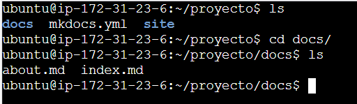
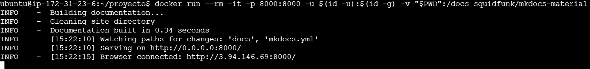
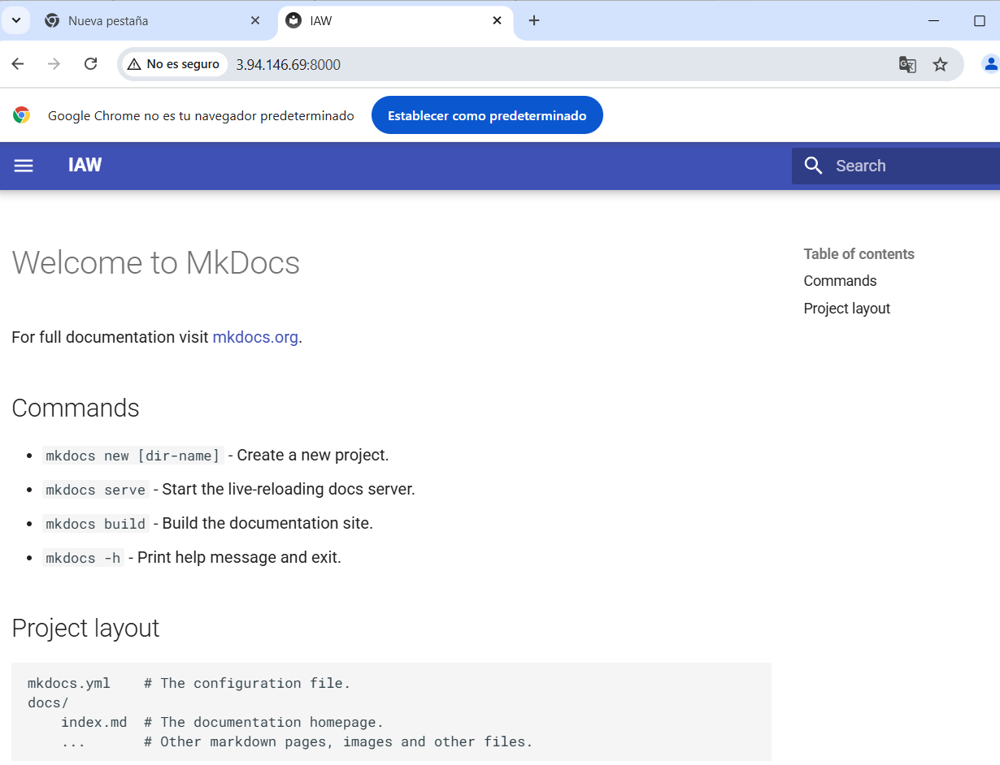
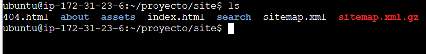
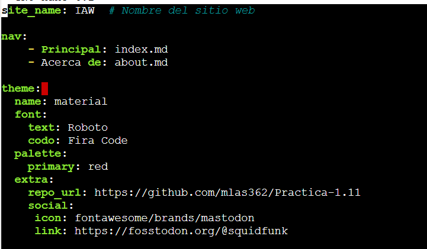
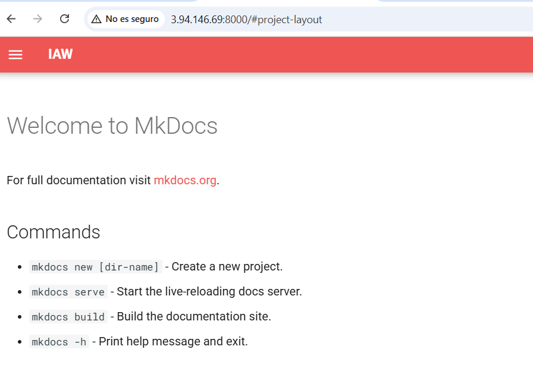

# 🚀 Configuración de MkDocs con Material en AWS EC2

Este documento describe los pasos necesarios para la Creación de un sitio web estático con MkDocs y GitHub Pages.
---
## 📂 3. Crear y configurar el proyecto MkDocs

1. **Crear el directorio del proyecto:**
   ```bash
   mkdir proyecto && cd proyecto
   ```
2. **Crear un nuevo proyecto (Comando: new)**
   ```bash
   docker run --rm -it -p 8000:8000 -u $(id -u):$(id -g) -v "$PWD":/docs squidfunk/mkdocs-material new .
   ```
3. **Crear un servidor de desarrollo local (Comando: serve):**
   ```bash
   docker run --rm -it -p 8000:8000 -u $(id -u):$(id -g) -v "$PWD":/docs squidfunk/mkdocs-material
   ```
   
Aquí podemos ver la estructura de nuestro proyecto

   
Vemos como la creación del servidor de desarrollo local funciona correctamente

   
Accediendo a la IP pública de nuestra instancia con el puerto 8000, podemos ver nuestro sitio estático con MKDocs

4. **Generar la documentación (Comando: build):**
   ```bash
   docker run --rm -it -u $(id -u):$(id -g) -v "$PWD":/docs squidfunk/mkdocs-material build
   ```
   
Una vez ejecutado el comando para generar la documentación, vemos como se ha generado la carpeta site con los archivos para guardar la documentación

5. **Cambios en el archivo mkdocs.yml**
   
He cambiado el color, la letra y he añadido el repositorio de la práctica 1.11

   
Aquí vemos como los cambios han surgido efecto

